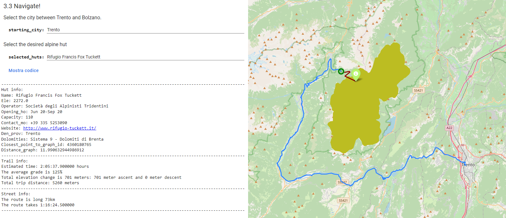

# Dolomities exploration :mount_fuji:

Geospatial project exam for UniTn 2021/22 course.

This project presents a large-scale analyses on the Dolomities investigating, from a geospatial point of view, their morphology and the most important point of interest such as the alpine huts and the major peaks. 

We will perform a network analyses on all the trails that allow to visit those mountains, generating insightful description and details on the difficulties and possible route to follow, also connecting them to the street network. 

Lastly we will perform a spatial analyses to understand if there is some correlation in the prices of the alpine huts according to the area in which they are.



all the notebooks already loaded with the interactive maps are visibile at the following [link](https://gabrieleghisleni.github.io/Geo-Dolomities/) :recycle:

<hr/>

## How to execute the code

This project has been developed in Google Colab; at the beginning of each notebook the specific requirements are installed, in order to run the code follow these steps:

1. [Open a new Colab notebook](https://colab.research.google.com/?hl=it)
1. [Mount the Google Drive](https://stackoverflow.com/questions/48376580/google-colab-how-to-read-data-from-my-google-drive)
2. Change the directory into your drive as follow: `import os; os.chdir('drive/MyDrive')`
3. In the first cell run the command `!git clone https://github.com/GabrieleGhisleni/Geo-Dolomities.git`
4. Open you Google Drive, enter in the folder Geo-Dolomities and just run the notebooks.
5. In *Environment Set up* modify the folder directory with yours pointing inside the cloned repository.

to sum up, open a new Colab notebook and run the following code:

```py
from google.colab import drive
import os

drive.mount('/content/drive')
os.chdir('drive/MyDrive')
!git clone https://github.com/GabrieleGhisleni/Geo-Dolomities.git

#then go to your Google Drive and checkout the Geo-Dolomities folder!
```